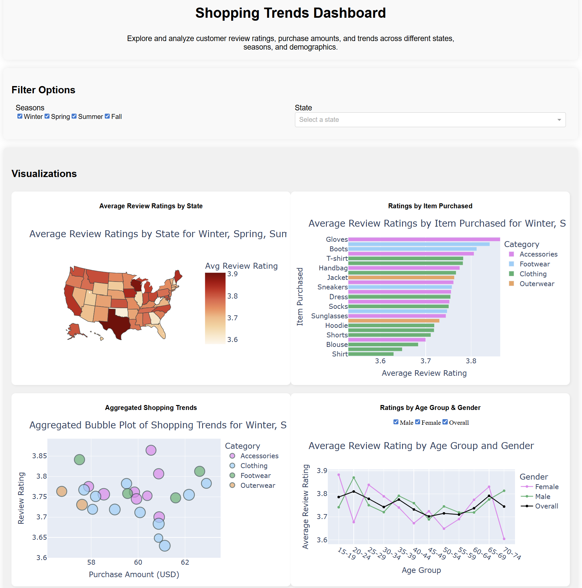

# 🛍️ Shopping Trends Interactive Dashboard

> **A visual deep-dive into consumer habits, regional trends, and retail data storytelling.**

---

## 📌 What is this?

This project is an interactive playground for exploring retail data. Instead of looking at boring spreadsheets, I built this dashboard to turn raw numbers into a visual story about how people shop across the US.

### 🔍 Cool Things You Can Explore:

* **The Heatmap:** Which states are actually the happiest with their purchases? (Spoiler: Check the average review ratings).
* **The Bubble Plot:** Does spending more money actually lead to better reviews? (Hint: The size of the bubble shows how loyal the customer is).
* **Demographic Trends:** How do shopping habits shift when you compare a 20-year-old vs. a 60-year-old?
* **Seasonal Vibes:** Use the filters to see how "Winter" shoppers differ from "Summer" shoppers.

---

## 🏗️ How I Built It

I used **Python** as the engine and **Plotly Dash** to build the interface.

* **Smart Data:** I wrote logic to automatically map state names to their map coordinates so the US map works perfectly.
* **Interactive Filters:** Everything is connected—change a season or a gender, and all four charts update instantly to show you the new data.
* **Modern Design:** I styled it with a clean, light-mode interface so the colors of the charts really pop.

---

## 📊 The Visuals

1. **US Map:** A bird's-eye view of customer satisfaction.
2. **Top Items Bar Chart:** See exactly what's trending in each category.
3. **Shopping Trends Bubble Plot:** A 3D-style look at price vs. rating.
4. **Age & Gender Line Plot:** Tracking satisfaction across different generations.

---

## 🚀 How to Run It Locally

You can easily run this dashboard right on your own computer:
1. Clone this repository and make sure you have the required libraries installed (`dash`, `pandas`, `plotly`).
2. Run `python visu_vs.py` in your terminal.
3. Open your web browser and navigate to `http://127.0.0.1:8050/`.

---

## 📂 What's in the Repo?

* `visu_vs.py`: All the code for the dashboard and the data logic.
* `shopping_trends_updated.csv`: The dataset powering the whole thing.

---
